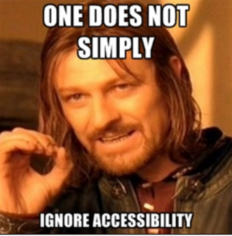

# Markdown to HTML

## NEW RESOURCES on FORMS

Resources
Read or watch:

# Web Form Usability Resources

- [An Extensive Guide To Web Form Usability — Smashing Magazine](https://www.smashingmagazine.com/2011/11/extensive-guide-web-form-usability/)
- [Forms - UX Movement](https://uxmovement.com/category/forms/)
- [Placeholders in Form Fields are Harmful (Video)](https://www.nngroup.com/videos/placeholders-form-fields/)
- [The Anatomy of Accessible Forms: Best Practices | Deque](https://www.deque.com/blog/anatomy-of-accessible-forms-best-practices/)
- [Pure CSS Custom Error Messaging for Default Form Elements – Sarah Holley Design](https://sarahholleydesign.com/pure-css-custom-error-messaging-for-default-form-elements/)

# MDN Resources

- [HTML forms - Learn web development | MDN](https://developer.mozilla.org/en-US/docs/Learn/Forms)
- [form - HTML: Hypertext Markup Language | MDN](https://developer.mozilla.org/en-US/docs/Web/HTML/Element/form)
- [fieldset: The Field Set element - HTML: Hypertext Markup Language | MDN](https://developer.mozilla.org/en-US/docs/Web/HTML/Element/fieldset)
- [legend - HTML: Hypertext Markup Language | MDN](https://developer.mozilla.org/en-US/docs/Web/HTML/Element/legend)
- [label - HTML: Hypertext Markup Language | MDN](https://developer.mozilla.org/en-US/docs/Web/HTML/Element/label)
- [input: The Input (Form Input) element - HTML: Hypertext Markup Language | MDN](https://developer.mozilla.org/en-US/docs/Web/HTML/Element/input)
- [tabindex - HTML: Hypertext Markup Language | MDN](https://developer.mozilla.org/en-US/docs/Web/HTML/Global_attributes/tabindex)
- [accesskey - HTML: Hypertext Markup Language | MDN](https://developer.mozilla.org/en-US/docs/Web/HTML/Global_attributes/accesskey)
- [button: The Button element - HTML: Hypertext Markup Language | MDN](https://developer.mozilla.org/en-US/docs/Web/HTML/Element/button)
- [select - HTML: Hypertext Markup Language | MDN](https://developer.mozilla.org/en-US/docs/Web/HTML/Element/select)
- [optgroup - HTML: Hypertext Markup Language | MDN](https://developer.mozilla.org/en-US/docs/Web/HTML/Element/optgroup)
- [datalist - HTML: Hypertext Markup Language | MDN](https://developer.mozilla.org/en-US/docs/Web/HTML/Element/datalist)
- [textarea - HTML: Hypertext Markup Language | MDN](https://developer.mozilla.org/en-US/docs/Web/HTML/Element/textarea)

# Form Validation Resources

- [Form Validation UX in HTML and CSS | CSS-Tricks](https://css-tricks.com/form-validation-ux-html-css/)
- [Constraint validation - Developer guides | MDN](https://developer.mozilla.org/en-US/docs/Web/HTML/Constraint_validation)
- [:invalid - CSS: Cascading Style Sheets | MDN](https://developer.mozilla.org/en-US/docs/Web/CSS/:invalid)
- [:valid - CSS: Cascading Style Sheets | MDN](https://developer.mozilla.org/en-US/docs/Web/CSS/:valid)
- [:optional - CSS: Cascading Style Sheets | MDN](https://developer.mozilla.org/en-US/docs/Web/CSS/:optional)

[A Crash Course on Accessibility](https://intranet.alxswe.com/concepts/549)

#Read or watch:

* [Accessibility is not a feature. — Ethan Marcotte](https://ethanmarcotte.com/wrote/accessibility-is-not-a-feature/)
* [How to Meet WCAG (Quickref Reference](https://www.w3.org/WAI/WCAG22/quickref/?versions=2.1)
* [Web Accessibility Guidebook for * Developers](https://www.telerik.com/blogs/web-accessibility-guidebook-for-developers)
* [Testing with assistive technologies - Service Manual - GOV.UK](https://www.gov.uk/service-manual/technology/testing-with-assistive-technologies)
* [A11Y Style Guide](https://a11y-style-guide.com/style-guide/)
* [Building Pylon-Free Web Pages: An Intro to Web Accessibility](https://engineering.vena.io/building-pylon-free-web-pages-an-intro-to-web-accessibility/)
* [I Threw Away my Mouse - 24 Accessibility](https://www.24a11y.com/2018/i-threw-away-my-mouse/)
* [I Used a Switch Control for a Day - 24 Accessibility](https://www.24a11y.com/2018/i-used-a-switch-control-for-a-day/)
* [The Myths of Color Contrast Accessibility](https://uxmovement.com/buttons/the-myths-of-color-contrast-accessibility/)
* [IAAP Certification](https://www.accessibilityassociation.org/s/certification)
* [Accessibility Blog | Deque Systems](https://www.deque.com/blog/)
* [Tink - Léonie Watson – On technology, food & life in the digital age](https://tink.uk/)
* [Accessibility Weekly](https://a11yweekly.com/)
* [Section508.gov | GSA Government-wide IT Accessibility Program](https://www.section508.gov/)

## Learning Objectives
At the end of this project, I was expected to be able to explain to anyone, without the help of Google:

* ARIA’s main purpose
* WCAG conformance levels (A, AA and AAA)
* The importance of Web Accessibility
* Tools to use for Web Accessibility

<strong>NB:</strong> This was an optional project.