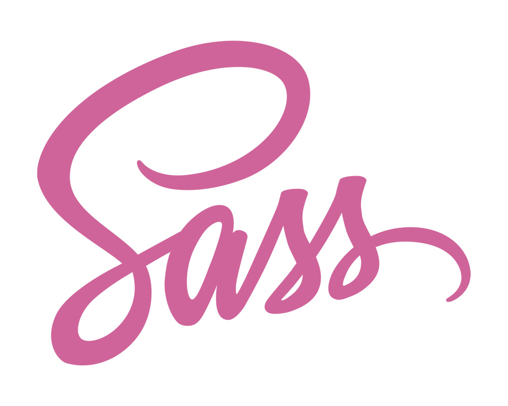

# Sass & Scss

# Resources
## Read or watch:

[Sass Basics](https://sass-lang.com/guide/)
[Sass flow control directives: @if, @for, @each and @while](https://sass-lang.com/documentation/at-rules/control/)
[Sass references](https://sass-lang.com/documentation/)

## Learning objectives
- What Sass means
- How to write Sass & Scss file
- What is the difference between Sass and Scss
- What is the Sass preprocessing
- How to declare a variable
- How to use nested definition
- How to import a Sass file
- How to use mixins
- How to declare extend/inheritance styles
- How to manipulate operators